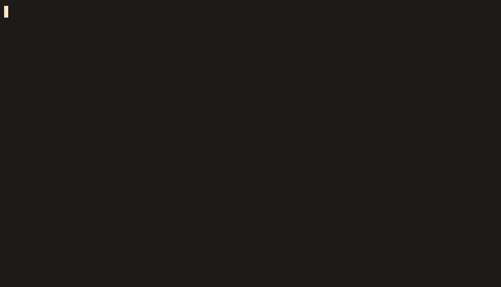

# pearasys

<!--toc:start-->

- [pearasys](#pearasys)
  - [`systemd`](#systemd)
  - [Examples](#examples)
  - [Usage](#usage) - [`pearasys pci`](#pearasys-pci) - [`pearasys pci driver`](#pearasys-pci-driver) - [`pearasys pci device`](#pearasys-pci-device) - [`pearapci service`](#pearapci-service)
  <!--toc:end-->

`pearasys` is a command-line tool for easily binding and unbinding PCIe device drivers by writing to [sysfs](https://www.kernel.org/doc/Documentation/ABI/testing/sysfs-bus-pci), primarily for use with switching a gpu between `vfio-pci` and an OEM driver.

## `systemd`

`pearasys` supports using systemd to control your device's drivers through a service. To install a service for a device, use the `service install` command:

```sh
$ sudo pearasys -d 10de:1b80 service install nvidia
# /etc/systemd/system/pearasys-0000:04:00.0@nvidia.service
[Unit]
Description=Binds /sys/bus/pci/devices/%j to %i
Conflicts=pearasys-0000:04:00.0@vfio-pci.service

[Service]
Type=oneshot
RemainAfterExit=true
ExecStart=/usr/local/bin/pearasys -v -s %j pci driver %i bind
ExecStop=/usr/local/bin/pearasys -v -s %j pci driver %i unbind
Restart=on-failure
RestartSec=5

[Install]
WantedBy=multi-user.target
DefaultInstance=vfio-pci

# vim: ft=systemd

Bind driver `nvidia` with command: `systemctl start pearasys-0000:04:00.0@nvidia.service`
Unbind device to make available for manual driver binding with command: `systemctl stop pearasys-0000:04:00.0@nvidia.service`
```

See the [`pearapci service`](#pearapci-service) section for more information.

## Examples

- Binding `nvidia` to a gpu and it's audio device:

```sh
pearasys \
  -d 10de:10f0 -d 10de:1b80 \
  pci \ # pci sub commands are chainable
    driver vfio-pci unbind \
    driver nvidia new-id
```

- Unbinding `vfio-pci` from a device:

```sh
pearasys \
  -d 10de:10f0 \
  pci \
    driver vfio-pci remove-id \
    device remove \
    rescan
```

**Note**: Attempting to unbind a driver from a device in use will result in a hung process. In the event this occurs, check to see if your display manager, `nvidia-persistenced`, or another process is running on your GPU.

## Usage

```sh
 Usage: pearasys [OPTIONS] COMMAND [ARGS]...

╭─ Options ─────────────────────────────────────────────────────────────────╮
│ --verbose             -v            Verbose output.                       │
│ --slot                -s      slot  <domain>:<bus>:<device>.<func>        │
│ --pid                 -d      pid   <vendor>:<device>                     │
│ --install-completion                Install completion for the current    │
│                                     shell.                                │
│ --show-completion                   Show completion for the current       │
│                                     shell, to copy it or customize the    │
│                                     installation.                         │
│ --help                              Show this message and exit.           │
╰───────────────────────────────────────────────────────────────────────────╯
╭─ Commands ────────────────────────────────────────────────────────────────╮
│ pci       Access PCI related resources under /sys/bus/pci                 │
│ service   pearasys systemd service related commands.                      │
╰───────────────────────────────────────────────────────────────────────────╯
```

- It is assumed that the files and directories under the /sys hierarchy are owned by `root:root`, so **[running as root is required](https://github.com/pearagit/pearasys/blob/master/src/pearasys/state.py#L24)**.

### `pearasys pci`

```sh

 Usage: pearasys pci [OPTIONS] COMMAND1 [ARGS]... [COMMAND2 [ARGS]...]...

 Access PCI related resources under /sys/bus/pci

╭─ Options ─────────────────────────────────────────────────────────────────╮
│ --help          Show this message and exit.                               │
╰───────────────────────────────────────────────────────────────────────────╯
╭─ Commands ────────────────────────────────────────────────────────────────╮
│ rescan   Forces a rescan and re-discovers removed devices.                │
│ device   Access resources under /sys/bus/pci/devices/                     │
│ driver   Access resources under /sys/bus/pci/drivers/                     │
╰───────────────────────────────────────────────────────────────────────────╯
```

#### `pearasys pci driver`

Commands for easily writing to the kernel objects under `/sys/bus/pci/drivers/<driver_name>`.

```sh
 Usage: pearasys pci driver [OPTIONS] driver_name COMMAND [ARGS]...

 See https://www.kernel.org/doc/Documentation/filesystems/sysfs-pci.txt

╭─ Arguments ───────────────────────────────────────────────────────────────╮
│ *    driver      driver_name  [required]                                  │
╰───────────────────────────────────────────────────────────────────────────╯
╭─ Options ─────────────────────────────────────────────────────────────────╮
│ --slot  -s      slot  <domain>:<bus>:<device>.<func>                      │
│ --pid   -d      pid   <vendor>:<device>                                   │
│ --help                Show this message and exit.                         │
╰───────────────────────────────────────────────────────────────────────────╯
╭─ Commands ────────────────────────────────────────────────────────────────╮
│ bind        /sys/bus/pci/drivers/.../bind                                 │
│ unbind      /sys/bus/pci/drivers/.../unbind                               │
│ new-id      /sys/bus/pci/drivers/.../new_id                               │
│ remove-id   /sys/bus/pci/drivers/.../remove_id                            │
│ ls          Lists the files in the driver directory.                      │
╰───────────────────────────────────────────────────────────────────────────╯


```

#### `pearasys pci device`

Commands for easily reading/writing to the kernel objects under `/sys/bus/pci/devices/<slot>`.

```sh
 Usage: pearasys pci device [OPTIONS] COMMAND [ARGS]...

 See https://www.kernel.org/doc/Documentation/ABI/testing/sysfs-bus-pci

╭─ Options ─────────────────────────────────────────────────────────────────╮
│ --slot    -s      slot            <domain>:<bus>:<device>.<func>          │
│ --pid     -d      pid             <vendor>:<device>                       │
│ --driver          driver command  See pearasys pci driver --help          │
│ --help                            Show this message and exit.             │
╰───────────────────────────────────────────────────────────────────────────╯
╭─ Commands ────────────────────────────────────────────────────────────────╮
│ remove            remove device from kernel's list                        │
│ driver-override   /sys/bus/pci/devices/.../driver_override                │
╰───────────────────────────────────────────────────────────────────────────╯
```

### `pearapci service`

```sh
 Usage: pearasys service install [OPTIONS] driver_name

 Installs a systemd service to manage a device's driver.

╭─ Arguments ───────────────────────────────────────────────────────────────╮
│ *    driver      driver_name  [required]                                  │
╰───────────────────────────────────────────────────────────────────────────╯
╭─ Options ─────────────────────────────────────────────────────────────────╮
│ --prefix        path  Specify the service installation directory.         │
│                       [default: /etc/systemd/system]                      │
│ --help                Show this message and exit.                         │
╰───────────────────────────────────────────────────────────────────────────╯
```
